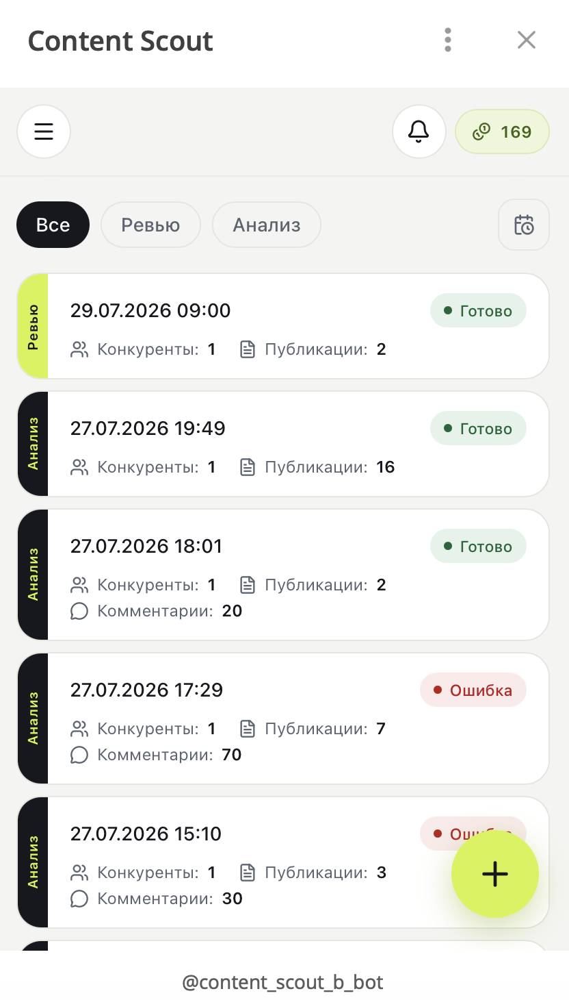
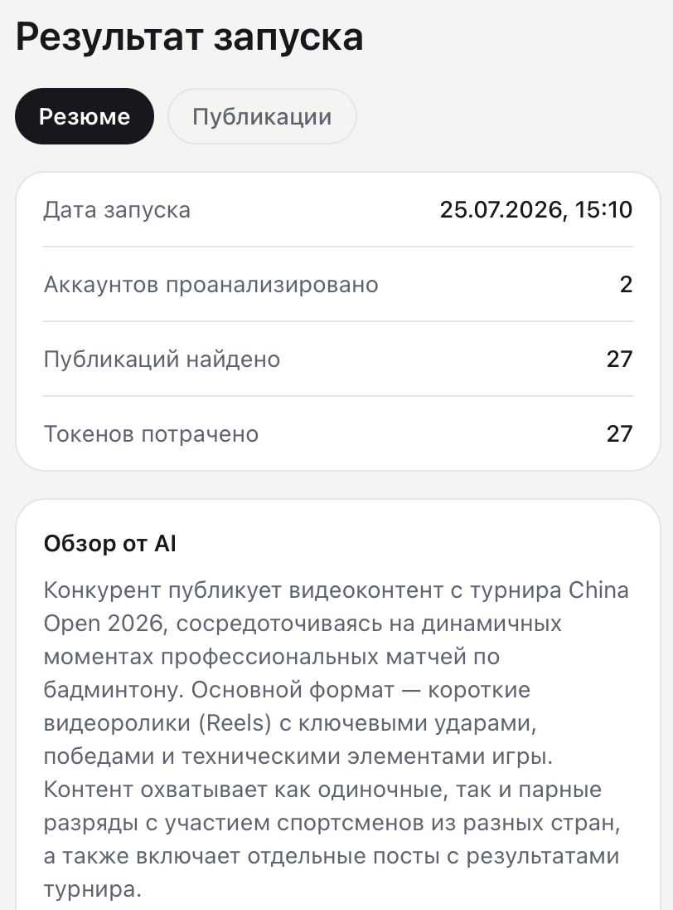
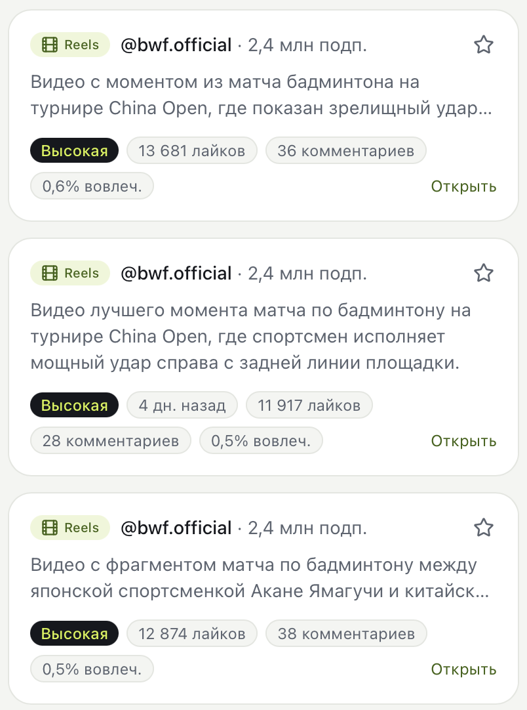
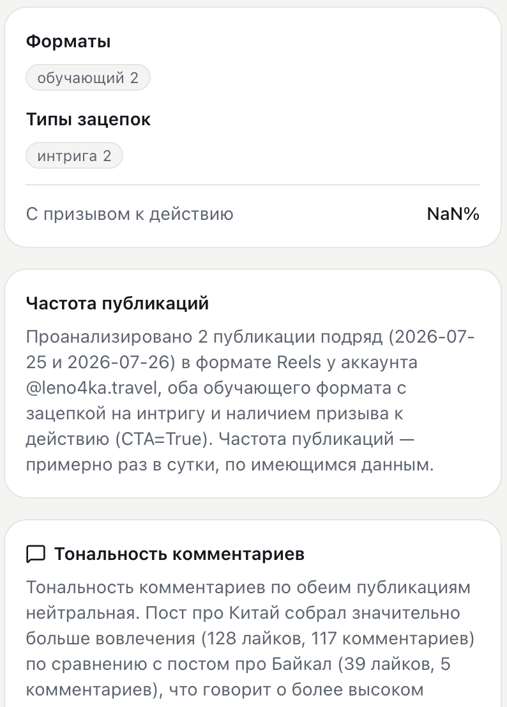
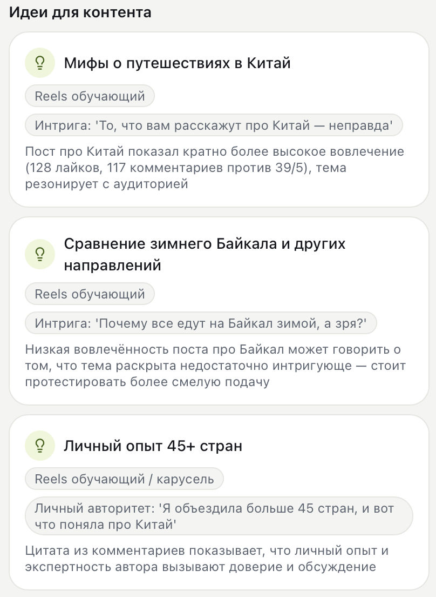
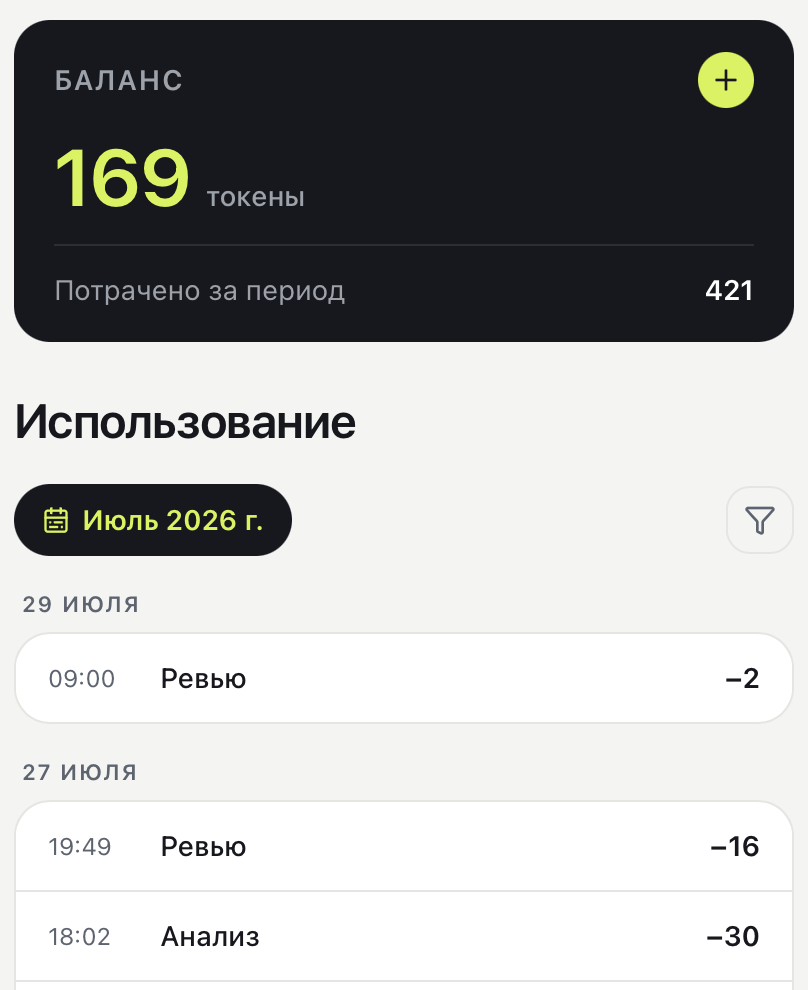
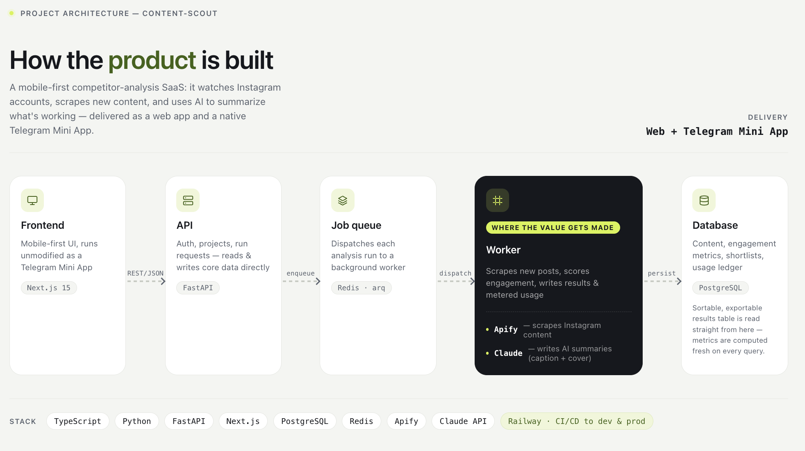

# content-scout

**AI-powered competitor content analysis for Instagram, delivered as a Telegram Mini App.**

Point it at up to 50 competitor Instagram accounts, pick a time window, and it scrapes every post published in that window, scores engagement, and writes a short AI summary of what's working — per post and for the run as a whole. Winners get starred to a shortlist; a token-based usage ledger meters every run so cost is always visible before you spend it.

## What it does

| | |
|---|---|
| **Track competitors, not just your own account** | Up to 50 Instagram accounts per project, grouped into scheduled or on-demand analysis runs. |
| **AI summaries, not raw data dumps** | Every post gets a 1–2 sentence AI-written summary (from caption + cover image); every run gets a written overview of what the competitor is doing and why it's working. |
| **Virality scoring** | Posts are ranked by a heat scale (Высокая / Средняя / Низкая), not a bare engagement number. |
| **Content ideas, generated from the data** | The AI proposes concrete content ideas, each grounded in a specific post and why it performed. |
| **Usage metered from day one** | Every run burns a transparent token balance — no surprise costs, no hidden per-call pricing. |
| **Lives where the user already is** | Same Next.js app runs as a web app and natively as a Telegram Mini App — no separate native build. |

## Screenshots

<table>
<tr>
<td width="33%" align="center"><br><sub>Run feed — every analysis run across all projects, with live status</sub></td>
<td width="33%" align="center"><br><sub>Run result — AI-written overview of a competitor's recent content</sub></td>
<td width="33%" align="center"><br><sub>Publications — every post found, ranked by virality</sub></td>
</tr>
<tr>
<td width="33%" align="center"><br><sub>Format &amp; hook breakdown, posting frequency, comment sentiment</sub></td>
<td width="33%" align="center"><br><sub>AI-generated content ideas, each grounded in a real post</sub></td>
<td width="33%" align="center"><br><sub>Token balance &amp; itemized usage history</sub></td>
</tr>
</table>

## Architecture



Full write-up: [`docs/ARCHITECTURE.md`](docs/ARCHITECTURE.md) · design system: [`docs/DESIGN_SYSTEM.md`](docs/DESIGN_SYSTEM.md)

## Stack

- **Backend:** Python 3.12, FastAPI, SQLAlchemy + Alembic, arq worker, PostgreSQL, Redis
- **Frontend:** Next.js 15, TypeScript, Tailwind, TanStack Table, next-intl (ru)
- **Data:** Apify Instagram scrapers
- **AI:** Claude (Anthropic) — Haiku for summaries, a stronger model for content-idea generation
- **Deploy:** Railway (DEV + PROD), GitHub Actions

## Repository layout

```
backend/    FastAPI app, worker, migrations, backend tests
frontend/   Next.js app
docs/       Architecture, tech stack, testing, UI, prompts, screenshots
scripts/    bootstrap.sh (local setup), promote.sh (dev → prod)
```

## Environments

| Env | What | Deploy trigger |
|---|---|---|
| local | docker-compose Postgres + Redis, uvicorn + next dev | manual |
| DEV | Railway | push to `main` |
| PROD | Railway | git tag `v*` |

---

## Development

### Setup (local)

```bash
./scripts/bootstrap.sh
cp .env.example .env   # fill in values (see ENV.md)
```

### Working on this project

This project uses the APEX-DEV methodology. Start every session by reading `CLAUDE.md`, then `SPRINT.md`. Start a story with `/start-story E1-S1`.
